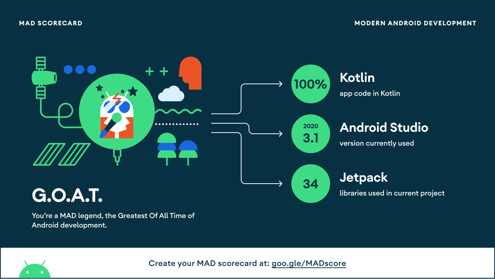

# FleksyMovieApp :tv:

The aim of this app is to replicate the high level functionality of www.themoviedb.org and showcase an android app out of it.
It connects with [TMDB_API](https://www.themoviedb.org/) to give you top rated movies and show similar movies with selected one.
FleksyMovieApp consists of 2 pieces of UI right now:
1. Home with Top Rated Movies
2. Similar Movies with selected one

*Note: FleksyMovieApp is an unofficial app built only for learning and sharing the latest concepts with #AndroidDevs*


## Android Development and Architecture
Project is based on MVVM with Clean Architecture and SOLID principle using Repository Pattern with UseCases.
Fully written in Kotlin using Android Jetpack components and libraries.
App implements "Single Activity - multiple Fragments" navigation pattern using Android Jetpack Compose.

Android Jetpack Architecture Components used:
- ViewModel
- LifeCycle  
- Navigation component
- Paging v3

Dependency injection:
- Dagger Hilt

Kotlin libraries:
- Kotlin Coroutines (with Flows)
- various ktx extensions

Testing: 
- Unit tests (with JUnit, MockWebServer)

## MAD Score



## Building the app

1.Open local.properties in the root directory

2.Add your [TMDB](https://www.themoviedb.org/) API key as follows

>API_KEY=ADD_YOUR_API_KEY_HERE

3.Run the app(debug).

`If you want to play with release flavor, you have to create your own signature!!!`

## Used Libraries 

- Jetpack Compose https://developer.android.com/jetpack/compose
- UI Pager https://google.github.io/accompanist/pager/
- Lottie Animation https://github.com/airbnb/lottie-android
- Landscapist https://github.com/skydoves/Landscapist
- Hilt https://developer.android.com/training/dependency-injection/hilt-android
- Retrofit https://square.github.io/retrofit/
- MockWebServer https://github.com/square/okhttp/tree/master/mockwebserver
- LeakCanary https://square.github.io/leakcanary/fundamentals/

## License

```
Copyright (c) 2021 Alper Özaslan

Permission is hereby granted, free of charge, to any person obtaining a copy
of this software and associated documentation files (the "Software"), to deal
in the Software without restriction, including without limitation the rights
to use, copy, modify, merge, publish, distribute, sublicense, and/or sell
copies of the Software, and to permit persons to whom the Software is
furnished to do so, subject to the following conditions:

The above copyright notice and this permission notice shall be included in all
copies or substantial portions of the Software.

THE SOFTWARE IS PROVIDED "AS IS", WITHOUT WARRANTY OF ANY KIND, EXPRESS OR
IMPLIED, INCLUDING BUT NOT LIMITED TO THE WARRANTIES OF MERCHANTABILITY,
FITNESS FOR A PARTICULAR PURPOSE AND NONINFRINGEMENT. IN NO EVENT SHALL THE
AUTHORS OR COPYRIGHT HOLDERS BE LIABLE FOR ANY CLAIM, DAMAGES OR OTHER
LIABILITY, WHETHER IN AN ACTION OF CONTRACT, TORT OR OTHERWISE, ARISING FROM,
OUT OF OR IN CONNECTION WITH THE SOFTWARE OR THE USE OR OTHER DEALINGS IN THE
SOFTWARE.
```